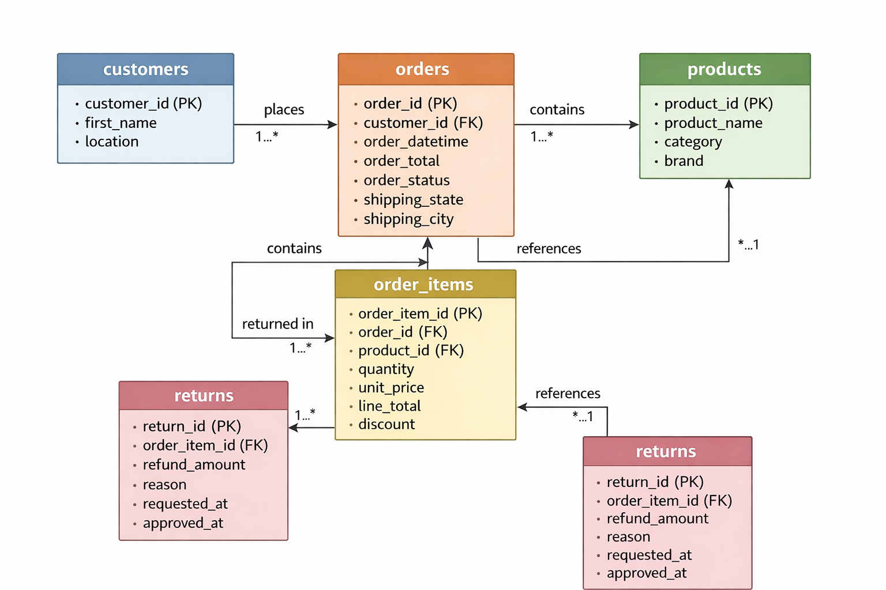

# 🛒 Atiq Retail Sales Analysis

> **End-to-end retail e-commerce analytics project** — 53 SQL insights, a 5-table relational database, and a Power BI dashboard covering Revenue, Products, Customer Intelligence, and Returns & Risk.

---

## 📌 Table of Contents

- [Project Overview](#-project-overview)
- [Problem Statement](#-problem-statement)
- [Key Metrics at a Glance](#-key-metrics-at-a-glance)
- [Tech Stack](#-tech-stack)
- [Database Schema & ER Diagram](#-database-schema--er-diagram)
- [Project Structure](#-project-structure)
- [SQL Analysis — 53 Insights](#-sql-analysis--53-insights)
  - [Section 1 · Revenue & Orders](#section-1--revenue--orders)
  - [Section 2 · Products & Inventory](#section-2--products--inventory)
  - [Section 3 · Customer Intelligence](#section-3--customer-intelligence)
  - [Section 4 · Returns & Risk](#section-4--returns--risk)
- [Power BI Dashboard](#-power-bi-dashboard)
- [Business Recommendations](#-business-recommendations)
- [How to Run](#-how-to-run)
- [Author](#-author)

---

## 📖 Project Overview

This project performs a comprehensive analysis of a **multi-brand retail e-commerce platform** operating across India. Using **MySQL** for analytical queries and **Power BI** for visualization, the project surfaces actionable insights across four business dimensions:

| Dimension | Focus |
|-----------|-------|
| **Revenue & Orders** | Monthly trends, payment channels, geographic concentration, peak hours, cancellations |
| **Products & Inventory** | Top sellers, category/brand revenue, discount efficiency, dead stock |
| **Customer Intelligence** | Segmentation, retention, churn detection, AOV, order frequency |
| **Returns & Risk** | Return rates by category, refund exposure by state, fulfilment efficiency, data quality |

---

## 🎯 Problem Statement

A multi-brand retail e-commerce platform operating across India faces three interconnected challenges:

1. **Revenue leakage** — Order cancellations put ₹2.1M at risk, and a rising return rate of **16.25%** erodes net margin.
2. **Uneven geographic performance** — The top 3 states contribute over 65% of revenue while smaller markets remain under-served.
3. **Product-level profitability gaps** — High-discount SKUs underperform in quantity sold, and Electronics leads category return rates, indicating a quality or expectation mismatch.

The business requires a structured diagnostic to pinpoint root causes, quantify impact, and prescribe targeted actions.

---

## 📊 Key Metrics at a Glance

| Metric | Value |
|--------|-------|
| Total Revenue | ₹48.2M |
| Total Orders | 12,340 |
| Average Order Value | ₹17.96K |
| Return Rate | 16.25% |
| Cancelled Orders | 843 (₹2.1M at risk) |
| Undelivered Orders | 1,920 |
| Peak Revenue Month | November — ₹72L |
| Peak Order Hour | 9 PM — 890 orders/hr |
| Repeat Customer Revenue Share | 74% |
| Registered-but-never-ordered | 6,060 customers |

---

## 🛠 Tech Stack

| Tool | Purpose |
|------|---------|
| **MySQL 8.0** | All 53 analytical SQL queries |
| **Power BI Desktop** | Interactive dashboard (3 pages) |
| **SQL Window Functions** | `ROW_NUMBER`, `LAG`, `RANK`, `DENSE_RANK` |
| **CTEs** | Complex multi-step aggregations |
| **GitHub** | Version control & project hosting |

---

## 🗃 Database Schema & ER Diagram

The project uses **5 relational tables**:

```
customers ──< orders ──< order_items >── products
                              │
                              └──< returns
```

### Table Definitions

#### `customers`
| Column | Type | Description |
|--------|------|-------------|
| `customer_id` | PK | Unique customer identifier |
| `first_name` | VARCHAR | Customer first name |
| `location` / `city` | VARCHAR | Customer city |

#### `orders`
| Column | Type | Description |
|--------|------|-------------|
| `order_id` | PK | Unique order identifier |
| `customer_id` | FK → customers | Placing customer |
| `order_datetime` | DATETIME | Order timestamp |
| `order_total` | DECIMAL | Total order value |
| `order_status` | VARCHAR | Placed / Confirmed / Shipped / Delivered / Cancelled |
| `shipping_state` | VARCHAR | Delivery state |
| `shipping_city` | VARCHAR | Delivery city |
| `payment_method` | VARCHAR | UPI / Credit Card / Debit Card / Net Banking / Wallet |

#### `order_items`
| Column | Type | Description |
|--------|------|-------------|
| `order_item_id` | PK | Unique line-item identifier |
| `order_id` | FK → orders | Parent order |
| `product_id` | FK → products | Product ordered |
| `quantity` | INT | Units ordered |
| `unit_price` | DECIMAL | Price per unit |
| `line_total` | DECIMAL | quantity × unit_price |
| `discount` | DECIMAL | Discount applied |

#### `products`
| Column | Type | Description |
|--------|------|-------------|
| `product_id` | PK | Unique product identifier |
| `product_name` | VARCHAR | Product name |
| `category` | VARCHAR | Electronics / Clothing / Footwear etc. |
| `brand` | VARCHAR | Brand name |

#### `returns`
| Column | Type | Description |
|--------|------|-------------|
| `return_id` | PK | Unique return identifier |
| `order_item_id` | FK → order_items | Returned line item |
| `refund_amount` | DECIMAL | Amount refunded |
| `reason` | VARCHAR | Return reason |
| `requested_at` | DATETIME | Return request timestamp |
| `approved_at` | DATETIME | Approval timestamp (NULL if pending) |

### ER Diagram



---

## 📁 Project Structure

```
atiq-retail-analysis/
│
├── README.md                          ← You are here
├── ER_Diagram.png                     ← Entity-Relationship diagram
├── Retail_SQL_Analysis_Script.sql     ← All 53 SQL queries
├── Retail_Sales_Analysis.pptx        ← Stakeholder presentation deck
│
└── powerbi/
    └── Retail_Sales_Analysis.pbix    ← Power BI dashboard file
```

---

## 🔍 SQL Analysis — 53 Insights

> Full queries are in [`Retail_SQL_Analysis_Script.sql`](Retail_SQL_Analysis_Script.sql)

---

### Section 1 · Revenue & Orders

#### Insight 1 — Weekend Order Count
```sql
SELECT COUNT(*) AS weekend_order_count
FROM (
  SELECT order_id, customer_id, order_datetime, payment_method, order_total,
         DAYOFWEEK(order_datetime) AS week
  FROM orders
  WHERE DAYOFWEEK(order_datetime) IN (1, 7)
) t;
```
> **Business value:** Quantifies weekend demand volume — informs staffing, server scaling, and weekend-specific promotions.

---

#### Insight 6 — Monthly Revenue & Orders
```sql
SELECT DATE_FORMAT(order_datetime, "%Y-%m") AS order_month,
       COUNT(order_id)  AS total_orders,
       SUM(order_total) AS total_revenue
FROM orders
GROUP BY order_month
ORDER BY order_month;
```
> **Business value:** Revenue peaks in November (₹72L) signalling strong festive demand. May and September dips are candidates for flash sale campaigns.

---

#### Insight 7 — Undelivered Orders
```sql
SELECT COUNT(order_status) AS total_not_delivered
FROM orders
WHERE order_status <> 'DELIVERED';
```
> **Business value:** 1,920 undelivered orders represent an active SLA risk — surface for logistics team escalation.

---

#### Insight 8 — Payment Method Revenue Ranking
```sql
SELECT payment_method,
       SUM(order_total) AS total_revenue
FROM orders
GROUP BY payment_method
ORDER BY total_revenue DESC;
```
> **Business value:** UPI drives 38% of revenue. Wallet at 6% is under-utilised — cashback campaigns can drive adoption.

---

#### Insight 9 — Top 5 Cities by Revenue
```sql
SELECT shipping_city,
       SUM(order_total) AS city_revenue
FROM orders
GROUP BY shipping_city
ORDER BY city_revenue DESC
LIMIT 5;
```
> **Business value:** Mumbai, Delhi, and Bangalore account for ~45% of revenue. Last-mile investment should be concentrated here.

---

#### Insight 25 — Cancelled Orders & Revenue at Risk
```sql
SELECT COUNT(order_id)  AS cancelled_orders,
       SUM(order_total) AS cancelled_revenue
FROM orders
WHERE order_status = 'cancelled';
```
> **Business value:** 843 cancellations = ₹2.1M revenue leakage. Deploy cancellation-prevention nudges at the cancellation trigger point.

---

#### Insight 30 — Peak Ordering Hours
```sql
SELECT HOUR(order_datetime) AS order_hour,
       COUNT(order_id)       AS total_orders
FROM orders
GROUP BY order_hour
ORDER BY total_orders DESC;
```
> **Business value:** Primary peak at 9 PM (890 orders), secondary at 1 PM (620 orders). Schedule flash sales and push notifications 30 minutes ahead of these windows.

---

#### Insight 32 — Month-over-Month Revenue Growth
```sql
WITH monthly_revenue AS (
  SELECT DATE_FORMAT(order_datetime, "%Y-%m") AS month_year,
         SUM(order_total) AS total_revenue
  FROM orders
  GROUP BY month_year
)
SELECT *,
  LAG(total_revenue) OVER (ORDER BY month_year) AS prev_month_revenue,
  ROUND(
    (total_revenue - LAG(total_revenue) OVER (ORDER BY month_year))
    / LAG(total_revenue) OVER (ORDER BY month_year) * 100, 2
  ) AS mom_growth_pct
FROM monthly_revenue;
```
> **Business value:** November posted +21.8% MoM growth. Negative MoM in May (−4.9%) and September (−12.7%) are pre-plan candidates for targeted campaigns.

---

### Section 2 · Products & Inventory

#### Insight 5 — Products Selling Above Average Quantity
```sql
SELECT product_id, SUM(quantity) AS total_quantity
FROM order_items
GROUP BY product_id
HAVING SUM(quantity) > (SELECT AVG(quantity) FROM order_items);
```
> **Business value:** Identifies high-velocity SKUs requiring shorter replenishment cycles and priority warehouse positioning.

---

#### Insight 12 — Top 5 Products by Quantity Sold
```sql
SELECT oi.product_id, p.product_name,
       SUM(quantity) AS total_qty_sold
FROM products p
JOIN order_items oi ON p.product_id = oi.product_id
GROUP BY oi.product_id, p.product_name
ORDER BY total_qty_sold DESC
LIMIT 5;
```
> **Business value:** Wireless Earbuds lead at 1,840 units. These are bundle promotion anchors to raise basket size.

---

#### Insight 13 — Category-Wise Revenue
```sql
SELECT p.category,
       SUM(line_total) AS category_revenue
FROM products p
JOIN order_items oi ON p.product_id = oi.product_id
GROUP BY p.category
ORDER BY category_revenue DESC;
```
> **Business value:** Electronics (₹14.2M) and Clothing (₹10.8M) together drive 53% of revenue — concentrate buying and merchandising budgets here.

---

#### Insight 14 — Discount % per Order Item
```sql
SELECT order_item_id, product_id, unit_price, discount,
       ROUND((discount / unit_price) * 100, 2) AS discount_pct
FROM order_items
ORDER BY discount_pct DESC
LIMIT 10;
```
> **Business value:** Surfaces items with extreme discounting — cross-reference with return rates to detect discount-driven low-intent purchases.

---

#### Insight 17 — Active Products with Zero Sales (90 days)
```sql
SELECT p.product_id, p.product_name, COUNT(o.order_id) AS total_orders
FROM products p
LEFT JOIN order_items oi ON p.product_id = oi.product_id
LEFT JOIN orders o ON o.order_id = oi.order_id
  AND order_datetime >= (SELECT MAX(order_datetime) FROM orders) - INTERVAL 90 DAY
GROUP BY p.product_id, p.product_name
HAVING COUNT(o.order_id) = 0;
```
> **Business value:** Dead stock identified — these SKUs tie up working capital. Action: markdown, bundle, or supplier return.

---

#### Insight 23 — Brand-Wise Revenue Contribution
```sql
SELECT p.brand, SUM(oi.line_total) AS brand_revenue
FROM products p
JOIN order_items oi ON p.product_id = oi.product_id
GROUP BY p.brand
ORDER BY brand_revenue DESC;
```
> **Business value:** Samsung (₹9.2M) and Nike (₹6.8M) account for ~45% of brand revenue — negotiate volume rebates with top 2 suppliers.

---

#### Insight 37 — High-Discount, Low-Sales Products
```sql
WITH product_sales AS (
  SELECT p.product_id, product_name,
         SUM(quantity) AS total_quantity,
         ROUND(AVG((oi.discount / oi.unit_price) * 100), 2) AS avg_discount_pct
  FROM products p
  JOIN order_items oi ON p.product_id = oi.product_id
  GROUP BY p.product_id, product_name
)
SELECT * FROM product_sales
WHERE avg_discount_pct > 10
  AND total_quantity < (SELECT AVG(total_quantity) FROM product_sales);
```
> **Business value:** Identifies products where discounting is not driving volume — margin erosion without sales benefit. These require repositioning or delisting.

---

### Section 3 · Customer Intelligence

#### Insight 4 — Order Value Bucketing
```sql
SELECT c.customer_id, first_name, order_id, order_total,
  CASE
    WHEN order_total < 1000                THEN 'Low'
    WHEN order_total BETWEEN 1000 AND 4999 THEN 'Medium'
    ELSE 'High'
  END AS order_bucket
FROM customers c
JOIN orders o ON c.customer_id = o.customer_id;
```
> **Business value:** Segments customers by spend tier. 'High' bucket customers (>₹5K/order) are BNPL partnership candidates to remove spend friction.

---

#### Insight 10 — Average Order Value per Customer
```sql
SELECT o.customer_id, first_name, city,
       ROUND(AVG(order_total), 2) AS AOV
FROM orders o
JOIN customers c ON o.customer_id = c.customer_id
GROUP BY customer_id, first_name, city
ORDER BY AOV DESC;
```
> **Business value:** Platform AOV of ₹17.96K. Set free-shipping threshold at ₹19K to nudge average spend upward.

---

#### Insight 16 — High-Frequency Buyers (Last 6 Months)
```sql
SELECT c.customer_id, c.first_name, city,
       COUNT(order_id) AS total_orders
FROM orders o
JOIN customers c ON c.customer_id = o.customer_id
WHERE order_datetime > (SELECT MAX(order_datetime) FROM orders) - INTERVAL 6 MONTH
GROUP BY customer_id
HAVING COUNT(order_id) > 2;
```
> **Business value:** Identifies VIP-eligible customers for early access, exclusive bundles, and loyalty tiers.

---

#### Insight 18 — Average Days Between Consecutive Orders
```sql
SELECT customer_id,
       AVG(DATEDIFF(order_datetime, previous_order_date)) AS avg_gap_days
FROM (
  SELECT customer_id, order_datetime,
         LAG(order_datetime) OVER (PARTITION BY customer_id ORDER BY order_datetime) AS previous_order_date
  FROM orders
) t
WHERE previous_order_date IS NOT NULL
GROUP BY customer_id
ORDER BY avg_gap_days DESC;
```
> **Business value:** Customers with longest gaps are win-back targets. Email campaigns before the 150-day churn window close re-engagement at lowest CAC.

---

#### Insight 26 — Order Count Distribution Buckets
```sql
SELECT customer_id, total_order,
  CASE
    WHEN total_order = 1                THEN '1'
    WHEN total_order BETWEEN 2 AND 5   THEN '2-5'
    WHEN total_order BETWEEN 6 AND 10  THEN '6-10'
    ELSE '>10'
  END AS order_bucket
FROM (
  SELECT customer_id, COUNT(order_id) AS total_order
  FROM orders GROUP BY customer_id
) t;
```
> **Business value:** Largest cohort is 2–5 orders. The primary loyalty goal is moving this group into the 6–10 bucket.

---

#### Insight 29 — Repeat vs One-Time Customer Revenue
```sql
WITH customer_orders AS (
  SELECT customer_id,
         COUNT(order_id)  AS total_orders,
         SUM(order_total) AS total_revenue
  FROM orders GROUP BY customer_id
),
segmented AS (
  SELECT *,
    CASE WHEN total_orders = 1 THEN 'One-time' ELSE 'Repeat' END AS customer_type
  FROM customer_orders
)
SELECT customer_type, SUM(total_revenue) AS revenue_contribution
FROM segmented GROUP BY customer_type;
```
> **Business value:** Repeat customers contribute **74% of revenue** from 33% of the buyer base. Retention programmes deliver highest ROI.

---

#### Insight 33 — Churn Detection (150-Day Window)
```sql
SELECT customer_id, MAX(order_datetime) AS last_order_date
FROM orders o
JOIN customers c ON c.customer_id = o.customer_id
GROUP BY customer_id
HAVING MAX(order_datetime) < (SELECT MAX(order_datetime) FROM orders) - INTERVAL 150 DAY;
```
> **Business value:** Provides a 5-month warning window to intervene with win-back offers before customers become truly lost.

---

#### Insight 47 — Registered vs Active Customers
```sql
SELECT COUNT(DISTINCT c.customer_id) AS total_registered,
       COUNT(DISTINCT o.customer_id) AS customers_with_orders
FROM customers c
LEFT JOIN orders o USING (customer_id);
```
> **Business value:** 6,060 registered customers have never ordered. A first-order incentive email sequence can convert this dormant base into revenue.

---

#### Insight 53 — Customer Order Frequency Classification
```sql
WITH order_date_analysis AS (
  SELECT customer_id, order_datetime,
         DATEDIFF(order_datetime,
           LAG(order_datetime) OVER (PARTITION BY customer_id ORDER BY order_datetime)
         ) AS gap_days
  FROM orders
)
SELECT customer_id,
  CASE
    WHEN AVG(gap_days) <= 30              THEN 'Fast'
    WHEN AVG(gap_days) BETWEEN 31 AND 90  THEN 'Medium'
    ELSE 'Slow'
  END AS order_frequency
FROM order_date_analysis
GROUP BY customer_id;
```
> **Business value:** Classifies customers into Fast/Medium/Slow buyers — enables frequency-specific engagement strategies and personalised nudges.

---

### Section 4 · Returns & Risk

#### Insight 11 — Data Integrity Check (order_total vs line_total)
```sql
SELECT o.order_id, order_total,
       SUM(line_total) AS calculated_sum
FROM orders o
JOIN order_items oi ON o.order_id = oi.order_id
GROUP BY o.order_id, order_total
HAVING order_total != SUM(line_total);
```
> **Business value:** Detects billing discrepancies that affect revenue recognition and financial reporting accuracy. Must be investigated immediately.

---

#### Insight 21 — Return Approvals Taking ≥ 5 Days
```sql
SELECT return_id, refund_amount,
       DATEDIFF(approved_at, requested_at) AS approval_days
FROM returns
WHERE approved_at IS NOT NULL
  AND DATEDIFF(approved_at, requested_at) >= 5;
```
> **Business value:** 214 slow approvals breach customer experience SLAs. Automate same-day approval for refunds below ₹1,000.

---

#### Insight 22 — Category-Wise Return Rate
```sql
WITH category_sales AS (
  SELECT category, SUM(quantity) AS total_sold
  FROM products p
  JOIN order_items oi ON p.product_id = oi.product_id
  GROUP BY category
),
category_returns AS (
  SELECT category, SUM(quantity) AS total_returns
  FROM products p
  JOIN order_items oi USING (product_id)
  JOIN returns r USING (return_id)
  GROUP BY category
)
SELECT cs.category, cs.total_sold, cr.total_returns,
       ROUND((cr.total_returns / cs.total_sold) * 100, 2) AS return_rate_pct
FROM category_sales cs
JOIN category_returns cr USING (category);
```
> **Business value:** Clothing leads at 12.1% return rate (size/fit issues). A virtual size guide can reduce this by 3–4 percentage points, saving ~₹1.2M/year in reverse logistics.

---

#### Insight 35 — State Revenue vs Refund Exposure
```sql
WITH statewise_revenue AS (
  SELECT shipping_state, SUM(order_total) AS total_revenue
  FROM orders GROUP BY shipping_state
),
state_refunds AS (
  SELECT o.shipping_state, SUM(r.refund_amount) AS return_amount
  FROM orders o
  JOIN order_items oi ON o.order_id = oi.order_id
  JOIN returns r ON oi.order_item_id = r.order_item_id
  GROUP BY o.shipping_state
)
SELECT sr.shipping_state, total_revenue,
       IFNULL(return_amount, 0) AS refund_amount,
       ROUND(SUM(return_amount / total_revenue) * 100, 2) AS return_pct
FROM statewise_revenue sr
JOIN state_refunds srr ON sr.shipping_state = srr.shipping_state
GROUP BY sr.shipping_state
ORDER BY return_pct DESC;
```
> **Business value:** Gujarat shows 11.13% return-to-revenue ratio — 2.7× the national average. Requires immediate root-cause analysis of local product mix and delivery partner quality.

---

#### Insight 38 — Order Fulfilment Efficiency by City
```sql
SELECT shipping_city,
       COUNT(order_id) AS total_orders,
       SUM(CASE WHEN order_status = 'Delivered' THEN 1 ELSE 0 END) AS delivered_orders,
       ROUND(
         SUM(CASE WHEN order_status = 'Delivered' THEN 1 ELSE 0 END)
         / COUNT(order_id) * 100, 2
       ) AS fulfilment_efficiency_pct
FROM orders
GROUP BY shipping_city;
```
> **Business value:** Pune at 82.3% is the weakest city for fulfilment. Issue a 30-day SLA improvement notice to the current logistics partner.

---

#### Insight 39 — Return Reason Revenue Impact
```sql
SELECT reason,
       COUNT(return_id)   AS total_returns,
       SUM(refund_amount) AS total_refund_amount,
       ROUND(
         SUM(refund_amount) / (SELECT SUM(order_total) FROM orders) * 100, 2
       ) AS revenue_impact_pct
FROM returns
GROUP BY reason
ORDER BY revenue_impact_pct DESC;
```
> **Business value:** Defective Product (1.8% revenue impact) is the top return reason. Supplier quality audits with penalisation clauses for defect rates >2% are the immediate fix.

---

## 📊 Power BI Dashboard

The dashboard is structured across **3 pages**, directly mirroring the SQL analysis:

### Page 1 — Revenue & Orders
- Monthly revenue trend (bar + line combo)
- Payment method revenue split (donut chart)
- Top 5 cities by revenue (horizontal bar)
- State-wise order summary table
- Peak ordering hours heatmap
- KPI cards: Total Revenue · Total Orders · Undelivered · Cancelled

### Page 2 — Products & Customers
- Customer retention cohort matrix
- Top 5 products by quantity (bar chart)
- Pareto analysis of product revenue
- Category-wise revenue (horizontal bar)
- Avg basket size · Avg order value KPIs
- Brand vs Category toggle filter

### Page 3 — Returns & Risk
- High-return customer count
- Slow return approval count
- Category return rate % (bar chart)
- State revenue vs refund exposure (grouped bar)
- Return reason impact table
- Order fulfilment efficiency by city
- Month-over-month revenue growth (combo chart)

### Dashboard Preview

> 📁 Open `powerbi/Retail_Sales_Analysis.pbix` in Power BI Desktop to explore the interactive dashboard.

---

## 💡 Business Recommendations

### Revenue & Orders
| Priority | Action | Impact |
|----------|--------|--------|
| 🔴 High | Deploy cancellation-prevention nudges at cancel trigger | Recover ₹2.1M |
| 🔴 High | Schedule flash sales at 8–10 PM peak window | Max conversion |
| 🟡 Medium | UPI-exclusive offers to reduce checkout friction | Drive 38% channel |
| 🟡 Medium | Pre-plan May & September campaigns to counter seasonal dips | Revenue recovery |

### Products & Inventory
| Priority | Action | Impact |
|----------|--------|--------|
| 🔴 High | Liquidate 90-day dead stock via markdowns | Free working capital |
| 🔴 High | Delist high-discount / below-avg-volume SKUs | Margin protection |
| 🟡 Medium | Bundle Wireless Earbuds with accessories | Raise basket size |
| 🟢 Low | Negotiate volume rebates with Samsung & Nike | Cost reduction |

### Customer Intelligence
| Priority | Action | Impact |
|----------|--------|--------|
| 🔴 High | First-order incentive campaign for 6,060 dormant accounts | Incremental revenue |
| 🔴 High | Win-back campaign before 150-day churn window | Retention |
| 🟡 Medium | VIP tier for Fast buyers (≤30-day gap) | CLV maximisation |
| 🟡 Medium | Set free-shipping threshold at ₹19K | AOV nudge |

### Returns & Risk
| Priority | Action | Impact |
|----------|--------|--------|
| 🔴 High | Supplier quality audit — Defective returns (1.8% revenue impact) | Reduce refunds |
| 🔴 High | Barcode verification at pack station — eliminate Wrong Item returns | 420 returns/cycle |
| 🔴 High | SLA notice to Pune logistics partner (82.3% efficiency) | Fulfilment fix |
| 🟡 Medium | Virtual size guide for Clothing (12.1% return rate) | Save ~₹1.2M/year |
| 🟡 Medium | Automate same-day refund approval for amounts <₹1,000 | CSAT improvement |

---

## ▶️ How to Run

### Prerequisites
- MySQL 8.0+
- Power BI Desktop (free — [download here](https://powerbi.microsoft.com/desktop/))

### Step 1 — Set up the database

```sql
CREATE DATABASE atiq_retail;
USE atiq_retail;
```

Then create the 5 tables using the schema definitions above and import your data.

### Step 2 — Run the SQL analysis

```bash
# Option A: run the full script
mysql -u root -p atiq_retail < Retail_SQL_Analysis_Script.sql

# Option B: open in MySQL Workbench and run sections individually
```

### Step 3 — Open the Power BI dashboard

1. Open Power BI Desktop
2. File → Open → select `powerbi/Retail_Sales_Analysis.pbix`
3. Update the data source connection to point to your MySQL instance:
   - Home → Transform Data → Data Source Settings
   - Update server and database name
4. Click **Refresh** to load live data

### Step 4 — Explore insights

Navigate across the 3 dashboard pages using the bottom tab bar in Power BI.

---

## 👤 Author

**Atiq** — Retail Data Analyst

- 📧 [your.email@example.com](mailto:your.email@example.com)
- 💼 [LinkedIn](https://linkedin.com/in/your-profile)
- 🐙 [GitHub](https://github.com/your-username)

---

## 📄 License

This project is licensed under the MIT License — see the [LICENSE](LICENSE) file for details.

---

> ⭐ If this project helped you, consider giving it a star on GitHub!
